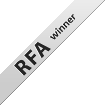

<html>
   <head>
      <META content="text/html; charset=UTF-8" http-equiv=Content-Type>
      <LINK href="alt.css" rel=STYLESHEET type=text/css>
      <title>AlternativaPlatform - Flash. 3D. Multiplayer.</title>
   </head>
   <body bgcolor="#570f00" background="img/bg.jpg" topmargin="0" leftmargin="0" rightmargin="0" bottommargin="0" marginheight="0" marginwidth="0">
      

         <table width="1010" border="0" cellspacing="0" cellpadding="0">
            <tr>
               <td background="img/topbg.jpg">
                  <table width="1010" border="0" cellspacing="0" cellpadding="0">
                     <tr>
                        <td align="right" valign="middle" class="bottom" style="height:50px; padding-right:20px;"></td>
                     </tr>
                  </table>
                  <table width="1010" border="0" cellspacing="0" cellpadding="0">
                     <tr>
                        <td align="left" valign="middle"></td>
                        <td width="582" background="img/menubg.png" style="height:48px">
                           <table width="582" border="0" cellspacing="0" cellpadding="0">
                              <tr>
                                 <td></td>
                                 <td align="center" valign="middle"></td>
                                 <td align="center" valign="middle"></td>
                                 <td align="center" valign="middle"></td>
                                 <td align="center" valign="middle"></td>
                                 <td align="center" valign="middle"></td>
                                 <td align="center" valign="middle"></td>
                                 <td></td>
                              </tr>
                           </table>
                        </td>
                     </tr>
                  </table>
               </td>
            </tr>
         </table>
         <table width="1010" border="0" cellspacing="0" cellpadding="0">
            <tr>
               <td background="img/mainpicbg.jpg" style="padding-top:80px; background-repeat:no-repeat;">
                  <table>
                     <tr>
                        <td style="padding-top:4px;"></td>
                        <td style="padding-left:10px;"></td>
                        <td style="padding-left:5px;"><a href="http://www.youtube.com/watch?v=lt6nDPQ2heM">Смотреть ролики</a></td>
                     </tr>
                  </table>
                    
                  
                    
                  Flash-3D-движок Alternativa3D теперь <b>бесплатен</b>. В том числе и новая, 7-ая версия 
                   
                  <table width="1010" border="0" cellspacing="0" cellpadding="0">
                     <tr>
                        <td valign="top" align="left" style="padding-top:40px; padding-bottom:40px;">
                           Нами был создан и развивается 3D-движок <a href="/ru/alternativa3d/">Alternativa3D</a>, позволяющий работать с трехмерной графикой и физикой на Flash, а так же высокопроизводительная <a href=/ru/alternativacore/>серверная часть</a>, способная сделать проекты многопользовательскими, в&nbsp;том&nbsp;числе realtime.
                           

                              На сегодняшний день решения применены в ряде браузерных игр, например &laquo;<a href="http://tankionline.com">Танки&nbsp;Онлайн</a>&raquo;, а так же в десятках промо-сайтов. Наши проекты и технологии были удостоены наград на Конференции разработчиков игр (КРИ-Awards), Russian&nbsp;Flash&nbsp;Awards, TheFWA. 
                        </td>
                        <td width="400" valign="top" align="left" style="padding-top:40px; padding-bottom:40px; padding-left:50px;">Мы работаем в плотном сотрудничестве с <a href="http://adobe.com">Adobe</a>. Посетите наш стенд и доклад на конференции <a href="http://max.adobe.com">Adobe MAX</a>. </td>
                     </tr>
                  </table>
               </td>
            </tr>
         </table>
         <table width="1010" border="0" cellspacing="0" cellpadding="0">
            <tr>
               <td colspan="2"></td>
            </tr>
            <tr>
               <td colspan="2">
                  

               </td>
            </tr>
            <tr>
               <td style="padding-top:10px">Россия, Пермь, ул. Клары Цеткин, 9. Тел./факс (342) 238-76-78.</td>
               <td align="right" style="padding-top:10px"><a href="mailto:team@alternativaplatform.com">team@alternativaplatform.com</a></td>
            <tr>
               <td colspan="2" class="bottom" style="padding-top:10px">
                  © 2007-2010 ООО &laquo;Альтернатива&raquo;. Все права защищены. 
                  Использование данной веб-страницы подразумевает ваше согласие с <a href="/ru/terms_of_use/">Правилами пользования</a> и <a href="/ru/privacy_policy/">Политикой конфиденциальности</a>.
               </td>
            </tr>
         </table>
         
      

      

      
      
   </body>
</html>
